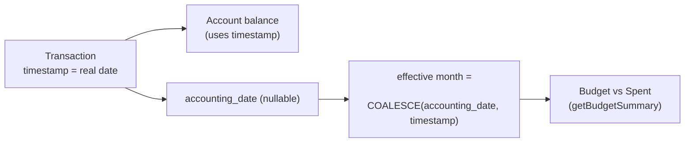

## Accounting Date (Month Attribution)

### Goal
Let a transaction count toward a budget month that differs from when the money actually moved. Headline case: month-end salary that belongs to next month's budget. We keep `timestamp` as the real event date (drives balances) and add a separate, optional `accounting_date` that drives month-based reporting.

### Design
- New nullable `accounting_date` (DATE) on `transactions`. When null, the effective reporting date falls back to `timestamp` via `COALESCE(accounting_date, timestamp::date)`. No backfill needed; existing rows behave exactly as today.
- Balances are unaffected — `getBalanceDelta` and FX snapshots keep using `timestamp`.
- Scope of consumers: Budgets only (recommended minimal change). Dashboard, goals, and the transactions list keep using `timestamp`. The column is general, so those can opt in later.
- UI: an income-focused "Count toward next month" toggle. When on, the client sends `accounting_date` = first day of the month after the transaction's date; when off, it sends `null`.



### Backend

1. Migration — new file `backend/src/migrations/<ts>-add-transaction-accounting-date.cjs` (mirror the style of [backend/src/migrations/20260502032000-add-transaction-query-indexes.cjs](backend/src/migrations/20260502032000-add-transaction-query-indexes.cjs)):
   - `addColumn('transactions', 'accounting_date', { type DATE, allowNull: true })`.
   - Optional expression index: `CREATE INDEX IF NOT EXISTS idx_transactions_user_effective_month ON transactions(user_id, COALESCE(accounting_date, "timestamp"))`.
   - `down`: drop index + column.

2. Model — [backend/src/models/transaction.model.js](backend/src/models/transaction.model.js): add `accounting_date: { type: DataTypes.DATEONLY, allowNull: true }` after `timestamp`.

3. Validation — [backend/src/validators/transaction.validation.js](backend/src/validators/transaction.validation.js): add to both create and update schemas:

```js
accounting_date: Joi.date().iso().optional().allow(null).messages({
  "date.format": "accounting_date must be an ISO date (e.g. 2026-07-01)",
}),
```

4. Service writes — [backend/src/services/transaction.service.js](backend/src/services/transaction.service.js):
   - `createTransaction` (and the savings allocate/transfer/external creators): pass `accounting_date: data.accounting_date ?? null` into each `Transaction.create({...})`.
   - `updateTransaction`: in the `allowed` block add `if (data.accounting_date !== undefined) allowed.accounting_date = data.accounting_date` (does not trigger FX reprice; it is reporting-only).
   - DTOs `mapTransactionListDTO` and `mapTransactionDetailDTO`: include `accounting_date: tx.accounting_date ?? null`.

5. Budget consumer — [backend/src/services/budget.service.js](backend/src/services/budget.service.js) `getBudgetSummary`: replace the `timestamp: { [Op.between]: [startDate, endDate] }` filter with an effective-month filter:

```js
import { Op, fn, col, where as sequelizeWhere } from "sequelize"
// ...
where: {
  user_id: userId,
  type: { [Op.in]: ["expense", "income", "savings"] },
  [Op.and]: [
    sequelizeWhere(fn("COALESCE", col("accounting_date"), col("timestamp")), {
      [Op.between]: [startDate, endDate],
    }),
  ],
},
```

(`accounting_date` is DATE; Postgres widens it to timestamp at midnight, which sits inside the `[startOfMonth 00:00, endOfMonth 23:59:59.999]` window.)

### Frontend

6. Types — [frontend/src/types/transaction.ts](frontend/src/types/transaction.ts): add `accounting_date: string | null` to `TransactionListItem` (and any detail type used by the modal).

7. Modal — [frontend/src/features/transactions/components/CreateTransactionModal.tsx](frontend/src/features/transactions/components/CreateTransactionModal.tsx):
   - Add `countTowardNextMonth: boolean` to `FormState`; initialize from `initialTransaction.accounting_date` (true when it lands in the month after the timestamp's month).
   - Render a shadcn `Switch` + `Label` in the details step, shown when `form.type === "income"`, with helper copy like "For month-end pay that belongs to next month's budget."
   - In `handleSubmit`, derive the value from the chosen date:

```ts
const buildAccountingDate = (dateValue: string, on: boolean) => {
  if (!on || !dateValue) return null
  const d = new Date(`${dateValue}T00:00`)
  return toDateString(new Date(d.getFullYear(), d.getMonth() + 1, 1))
}
```

   - Add `accounting_date: buildAccountingDate(form.dateValue, form.countTowardNextMonth)` to the payload (sent on both create and edit).
   - Add a row to `reviewSection` showing "Counts toward" = next-month label when enabled.

### Edge cases / notes
- Toggling off on edit sends `accounting_date: null`, restoring fallback to `timestamp`.
- Savings transfer pairs: only the primary leg needs `accounting_date`; mirror legs are reporting-neutral (the budget filter already includes both legs by type, but transfers net out in budgets today, so no special handling required).
- No change to balances, FX, list ordering, or list date filters.

### Out of scope (future, enabled by this column)
- A general month-picker (reusing [frontend/src/components/MonthPickerField.tsx](frontend/src/components/MonthPickerField.tsx)) for any transaction type.
- Dashboard summary and savings goals honoring `accounting_date`.