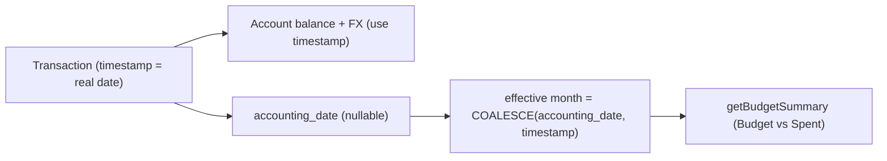

# Accounting Date (Month Attribution)

## Goal
Let a transaction count toward a budget month different from when the money actually moved. Headline case: month-end salary that belongs to next month's budget. `timestamp` stays the real event date (drives balances + FX); a new optional `accounting_date` drives month-based budget reporting.

## Current state (verified)
- No `accounting_date` exists anywhere in code. A stale plan file (`.cursor/plans/accounting_date_attribution_dc2db07c.plan.md`) marks this "completed" but nothing was applied — treat as a fresh build.
- [backend/src/services/budget.service.js](backend/src/services/budget.service.js) `getBudgetSummary` filters spend by `timestamp: { [Op.between]: [startDate, endDate] }` (line ~275). This is the only consumer that changes.
- Migrations use raw SQL with `IF NOT EXISTS` (see [backend/src/migrations/20260505000600-add-account-metadata-fields.cjs](backend/src/migrations/20260505000600-add-account-metadata-fields.cjs)).
- No `switch.tsx`; `checkbox.tsx` + `label.tsx` exist. Modal uses custom segmented buttons.

## Data flow


## Scope decisions (adjustable)
- Toggle shown for income only (matches "this month vs next month" framing). Column is general, so other types can opt in later.
- Only Budgets honor `accounting_date`. Dashboard, transactions list, list date-filters, and savings goals keep using `timestamp`. Consequence: month-end salary appears in June's list but counts toward July's budget — intended.
- UI control: shadcn `Checkbox` + `Label` (exists; `Switch` does not). Avoids adding a component/dependency.

## Backend

1. Migration `backend/src/migrations/20260621000000-add-transaction-accounting-date.cjs` (raw SQL, mirror existing style):
   - `ALTER TABLE transactions ADD COLUMN IF NOT EXISTS accounting_date DATE;`
   - Optional index: `CREATE INDEX IF NOT EXISTS idx_transactions_user_effective_month ON transactions (user_id, COALESCE(accounting_date, "timestamp"));`
   - `down`: drop index + column.

2. Model — [backend/src/models/transaction.model.js](backend/src/models/transaction.model.js): add `accounting_date: { type: DataTypes.DATEONLY, allowNull: true }` right after `timestamp`.

3. Validation — [backend/src/validators/transaction.validation.js](backend/src/validators/transaction.validation.js): add to both `createTransactionSchema` and `updateTransactionSchema`:

```js
accounting_date: Joi.date().iso().optional().allow(null).messages({
  "date.format": "accounting_date must be an ISO date (e.g. 2026-07-01)",
}),
```

4. Service writes — [backend/src/services/transaction.service.js](backend/src/services/transaction.service.js):
   - Pass `accounting_date: data.accounting_date ?? null` into every `Transaction.create({...})` (main `createTransaction` plus `createSavingsAllocateTransaction`, `createSavingsExternalTransfer`, and the primary leg of `createSavingsTransferPair`; mirror leg stays null).
   - `updateTransaction`: in the `allowed` block add `if (data.accounting_date !== undefined) allowed.accounting_date = data.accounting_date` (reporting-only, must NOT trigger FX reprice — keep it out of the `shouldReprice` conditions).
   - Add `accounting_date: tx.accounting_date ?? null` to `mapTransactionListDTO` and `mapTransactionDetailDTO`.

5. Budget consumer — [backend/src/services/budget.service.js](backend/src/services/budget.service.js) `getBudgetSummary` transactions query: replace the `timestamp` filter with an effective-month filter (import `fn, col, where as sequelizeWhere` from sequelize):

```js
where: {
  user_id: userId,
  type: { [Op.in]: ["expense", "income", "savings"] },
  [Op.and]: [
    sequelizeWhere(fn("COALESCE", col("accounting_date"), col("timestamp")), {
      [Op.between]: [startDate, endDate],
    }),
  ],
},
```

`accounting_date` (DATE) is widened to timestamp at midnight by Postgres, sitting inside the `[startOfMonth 00:00, endOfMonth 23:59:59.999]` window.

## Frontend

6. Types — [frontend/src/types/transaction.ts](frontend/src/types/transaction.ts): add `accounting_date: string | null` to `TransactionListItem`.

7. Modal — [frontend/src/features/transactions/components/CreateTransactionModal.tsx](frontend/src/features/transactions/components/CreateTransactionModal.tsx):
   - Add `countTowardNextMonth: boolean` to `FormState`. In `buildInitialFormState`, initialize `true` when `initialTransaction.accounting_date` falls in the month after the timestamp's month (edit/clone), else `false`.
   - Render a `Checkbox` + `Label` in the details step, visible only when `form.type === "income"`, helper copy: "For month-end pay that belongs to next month's budget." Reset to `false` in `handleTypeChange` when leaving income.
   - Derive the value on submit:

```ts
const buildAccountingDate = (dateValue: string, on: boolean) => {
  if (!on || !dateValue) return null
  const d = new Date(`${dateValue}T00:00`)
  return toDateString(new Date(d.getFullYear(), d.getMonth() + 1, 1))
}
```

   - Add `accounting_date: buildAccountingDate(form.dateValue, form.type === "income" && form.countTowardNextMonth)` to the payload on both create and edit (sends `null` when off, restoring fallback).
   - Add a "Counts toward" row to `reviewSection` showing the next-month label when enabled.

## Edge cases / notes
- Toggling off on edit sends `accounting_date: null`.
- Savings transfer mirror legs stay `null`; budgets net transfers out today, so no special handling.
- No change to balances, FX, list ordering, or list date filters.
- The stale `.cursor/plans/accounting_date_attribution_dc2db07c.plan.md` can be ignored or deleted; this plan supersedes it.

## Verification
- Run the new migration; confirm column + index exist.
- Create month-end income with toggle on → appears in current month's transaction list, but `getBudgetSummary` counts it in next month's income.
- Toggle off / non-income → behaves exactly as today.