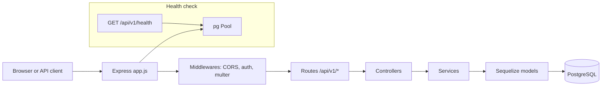

# PocketPal — Project documentation

This document describes **PocketPal** as implemented in this repository: architecture, how requests flow, how pieces connect, deployment, technology choices, gaps, frontend direction, and possible future AI features. It is meant to complement [DEPLOYMENT.md](./DEPLOYMENT.md) (operational deploy steps) and the root [README](../README.md).

---

## 1. What PocketPal is

**PocketPal** is a personal finance application. The codebase is a **monorepo** with:

- **`backend/`** — Production-ready **Node.js (Express 5)** REST API, **PostgreSQL** via **Sequelize**, JWT auth (HttpOnly cookies), structured logging (pino), and optional **Cloudinary** for user media.
- **`frontend/`** — **React 18** + **Vite 5** SPA; currently a **minimal shell** (placeholder UI), with CI/build pipelines ready for growth.

The backend exposes versioned routes under **`/api/v1/*`** and is designed for budgeting, accounts, categories, transactions, budgets, and goals.

---

## 2. Repository layout

| Path | Role |
|------|------|
| `backend/src/index.js` | Boot: connects DB, then `app.listen(PORT)`. |
| `backend/src/app.js` | Express app: CORS, JSON/urlencoded, static `public/`, cookies, request logger, route mounts, global error handler. |
| `backend/src/routes/` | Express routers only — HTTP method, path, middleware, controller. |
| `backend/src/controllers/` | Validation (Joi), call services, return `ApiResponse`, throw `ApiError`. |
| `backend/src/services/` | Business logic and DB access; no `req`/`res`. |
| `backend/src/models/` | Sequelize models + `associate()`. |
| `backend/src/validators/` | Joi schemas. |
| `backend/src/middlewares/` | Auth (`verifyJWT`), `asyncHandler`, multer, request logging. |
| `backend/src/db/` | Sequelize instance, connection bootstrap, `pg` pool (health check). |
| `backend/src/migrations/` | Sequelize CLI migrations (`.cjs` for CLI compatibility). |
| `backend/src/seeders/` | Seed data (CommonJS `.cjs`). |
| `frontend/src/` | React entry (`main.jsx`), root `App.jsx`, tests. |
| `docs/` | Deployment and project docs. |
| `.github/workflows/` | Backend/frontend CI and optional deploy hooks. |

---

## 3. Technology stack (what we use)

### Backend

| Area | Choice |
|------|--------|
| Runtime | Node.js (ES Modules: `"type": "module"` in `backend/package.json`). |
| HTTP | Express 5. |
| Database | PostgreSQL. |
| ORM | Sequelize 6. |
| Raw SQL / health | `pg` **Pool** (separate from Sequelize for lightweight `SELECT 1`-style checks). |
| Validation | Joi. |
| Auth | JWT (`jsonwebtoken`), **HttpOnly** cookies for access + refresh tokens. |
| Passwords | bcrypt. |
| File uploads | multer; optional Cloudinary for avatars/cover images. |
| Logging | pino (+ `pino-http` style request IDs in middleware). |
| API shape | JSON; success via `ApiResponse`, errors via global handler + `ApiError`. |

### Frontend

| Area | Choice |
|------|--------|
| UI library | React 18. |
| Build / dev | Vite 5. |
| Testing | Vitest, Testing Library, jsdom. |
| Lint | ESLint (React plugins). |

### Infrastructure (documented target)

| Area | Typical choice in this project |
|------|-------------------------------|
| Database hosting | **Neon** (Postgres branches per env). |
| API hosting | **Render** Web Service (`backend` root, `npm start`, health `/api/v1/health`). |
| Frontend hosting | **Vercel** (or similar static host); build injects public API URL. |
| CI | GitHub Actions (lint, test, build; backend also runs migrations against CI Postgres). |

---

## 4. What we do not use (yet) or intentionally avoid

- **No Plaid / bank aggregation / Open Banking** in code — the backend `package.json` does not include banking SDKs; rules mention Plaid only as a **future** concern for logging secrets.
- **No Stripe** or payment processing in-repo.
- **No Docker image** for the API in CI today (workflow comment notes Dockerfile as future).
- **No GraphQL** — REST only.
- **No Redis / queue** for general jobs — audit logs use an **in-memory batch queue** in `log.service.js` (flush timer + bulk insert), not a distributed queue.
- **No separate API gateway** — clients talk to Express directly.
- **Frontend** has no router, state library, or API client layer yet — it is a stub.

---

## 5. Backend architecture (layers and how things move)

### 5.1 Request lifecycle

1. **HTTP** hits Express (`app.js`).
2. **CORS** enforces a single `CORS_ORIGIN` (with credentials for cookies).
3. **Body parsers** populate `req.body`; **cookie-parser** fills `req.cookies`.
4. **`requestLogger`** attaches a request id (and integrates with logging).
5. **Route** matches `/api/v1/<resource>/...`.
6. **Middleware chain** runs (e.g. `verifyJWT` reads JWT from `Authorization: Bearer` or `accessToken` cookie, loads `User`, sets `req.user`).
7. **Controller** validates with Joi, calls **service**.
8. **Service** runs business rules and Sequelize (or helpers like FX in `fx.service.js`).
9. **Response**: `res.status(...).json(new ApiResponse(...))` or **throw** `ApiError`.
10. **Errors** bubble to the **global error handler** in `app.js`, which logs (pino) and returns JSON (no HTML).

`asyncHandler` wraps async controllers/middleware so rejected promises become `next(err)` and reach the same error handler.

### 5.2 How components connect

- **Sequelize** is the primary path for CRUD and associations.
- **`pool`** (`backend/src/db/pool.js`) shares the same connection configuration as Sequelize (`DATABASE_URL` or discrete `DB_*` vars) and is used for **fast DB liveness** in `healthCheckDB()` without going through the ORM.

### 5.3 API surface (resource map)

Routes are mounted in `app.js`:

| Base path | Domain |
|-----------|--------|
| `/api/v1/users` | Register, login, logout, refresh tokens, profile (`:id` → **`me`** for self), avatar/cover, password. |
| `/api/v1/accounts` | User accounts (per `account.routes.js`). |
| `/api/v1/categories` | Categories. |
| `/api/v1/category-groups` | Category groups. |
| `/api/v1/transactions` | Transactions (CRUD). |
| `/api/v1/budgets` | Budgets. |
| `/api/v1/goals` | Goals. |
| `/api/v1/health` | Health + DB check (Render health check path). |

Auth: most resource routes use **`verifyJWT`**; public endpoints include register/login/refresh (and health).

### 5.4 Data model (conceptual)

Models are registered in `backend/src/models/index.js` and associated after all are defined. Core entities include:

- **User** — internal `user_id`, external-facing **`public_id`** (UUID) where exposed.
- **Account**, **Transaction** — amounts in **minor units** (`amount_minor`, `amount_base_minor`) with **FX** via `FXRate` and **Currency** reference data.
- **Category**, **CategoryGroup**, **UserHiddenCategory** — user-scoped categorization.
- **Budget**, **BudgetPeriod**, **Goal** — planning features.
- **Log** — audit/business events (batched writes).
- **Currency**, **FXRate** — multi-currency support.

Transaction `type` includes deposit / withdrawal / savings; `source` enum includes manual, recurring, transfer, external (external bank feed is a **model hook** for future integration, not a live connector).

### 5.5 Authentication details

- **Access** and **refresh** JWTs are issued on login and can be stored in **HttpOnly** cookies (`secure: true`, `sameSite: "Strict"` in controller — local dev may need HTTPS or adjusted flags depending on environment).
- **Protected routes** use `verifyJWT`, which accepts **cookie** or **`Authorization: Bearer`**.
- **Refresh** endpoint reads refresh token from cookie or body.
- Password reset routes are **not implemented** (commented TODO in `user.routes.js`).

### 5.6 Observability and audit

- **Application logs**: pino; errors include `reqId`, path, method, user hint.
- **Audit table**: `createLog()` in `log.service.js` queues entries and **bulk-inserts** on a timer/size threshold — good for throughput, but **in-process only** (see limitations).

---

## 6. Database: migrations vs sync

- **Development** (`NODE_ENV` not `production`): `sequelize.sync({ alter: true })` runs in `backend/src/db/index.js` after authenticate — convenient but **not** the long-term schema authority for shared environments.
- **Production**: `sync({ alter: true })` is **skipped** when `NODE_ENV === "production"`; schema must come from **migrations** (`npm run db:migrate`).
- Initial schema lives in `backend/src/migrations/` (e.g. `20250314120000-initial-schema.cjs`).
- **CI** runs `npm run db:migrate` against a temporary Postgres service.

---

## 7. Deployment (how we ship it)

Detailed env vars and platform clicks are in **[DEPLOYMENT.md](./DEPLOYMENT.md)**. Summary:

| Component | Role |
|-----------|------|
| **Neon** | Postgres; per-environment **branch** → copy connection string into Render as `DATABASE_URL`. |
| **Render** | Runs the Node API from `backend/`, `npm start`, **Release Command** `npm run db:migrate`, **Health Check Path** `/api/v1/health`. |
| **Vercel (or similar)** | Hosts the SPA; set **`VITE_*` or framework public URL** to the **public** API base (no server secrets in the browser build). |
| **GitHub** | Optional **deploy hook** secrets (`RENDER_DEPLOY_HOOK_*`, `VERCEL_DEPLOY_HOOK_*`) for workflows; production DB secrets should **not** live in GitHub unless a workflow truly requires them. |

Branches referenced in workflows: **`develop`** (staging), **`prod`** (production).

---

## 8. CI/CD

| Workflow | Trigger | What it does |
|----------|---------|----------------|
| `backend-ci.yml` | Push to `develop` / `prod` when `backend/**` changes | `npm ci`, lint, `db:migrate` on CI Postgres, test. |
| `backend-deploy.yml` | Same path filter | `curl` Render deploy hook (staging vs prod by branch). |
| `frontend-ci.yml` | `frontend/**` | `npm ci`, lint, test, build. |
| `frontend-deploy.yml` | `frontend/**` | `curl` Vercel deploy hooks. |

Backend `npm test` is currently a **stub** (`process.exit(0)` in `package.json`) — CI passes but does not yet run a real test suite.

---

## 9. Frontend: current state and plan

### Current state

- **Stack**: React + Vite + Vitest; **`frontend/src/App.jsx`** is a minimal placeholder (“PocketPal” heading).
- **No** integrated API client, auth flow, or routing yet.

### Suggested plan (incremental)

1. **Config** — `import.meta.env.VITE_API_URL` (or project convention) pointing at Render API; document in frontend README when added.
2. **HTTP layer** — `fetch` wrapper with `credentials: "include"` for cookie-based JWT, centralized error handling matching `ApiResponse` / error JSON shape.
3. **Routing** — React Router (or similar) for `/login`, `/register`, `/dashboard`, etc.
4. **State** — Start with React context or lightweight stores; scale to TanStack Query for server cache if needed.
5. **UI** — Design system (components, layout, accessibility); charts for budgets/transactions later.
6. **Testing** — Component tests for forms; optional Playwright for E2E against staging API.

This aligns with [DEPLOYMENT.md](./DEPLOYMENT.md): browser origin must match **`CORS_ORIGIN`** on the API.

---

## 10. Limitations and known gaps

- **Bank linking**: No live aggregation; “external” transaction source is a data classification, not an active feed.
- **Password reset**: Not built.
- **Tests**: Backend test script is placeholder; limited automated regression coverage.
- **Horizontal scaling**: Log batching is **per-process**; multiple API instances do not share a single queue (acceptable for audit *eventual* consistency; consider Redis/DB-only writes for strict cross-node behavior).
- **Cookie `secure: true`**: Requires HTTPS in dev if testing cookies against non-local APIs; local HTTP may need env-specific cookie options (document when tightening).
- **Sequelize sync in non-prod**: Can cause drift vs migrations if teammates rely on `alter` differently — prefer migrations for anything shared.

---

## 11. Future: AI implementation (ideas, not commitments)

These are **architectural directions** if you add ML/LLM features later; nothing here is implemented as product AI today.

| Use case | Approach sketch |
|----------|-------------------|
| **Transaction categorization** | Batch or real-time classifier; train on user-edited labels; store model version in DB; never send full PAN/bank credentials to a model. |
| **Natural language queries** | “How much did I spend on food last month?” → structured query against Postgres (LLM maps NL → safe filter DSL you validate, then run). |
| **Anomaly / fraud hints** | Rules + optional anomaly scores; surface as suggestions, not blocking decisions. |
| **Receipt OCR** | Upload → OCR service → draft transaction; user confirms before commit. |
| **Privacy** | Prefer **server-side** inference or enterprise APIs; redact PII in prompts; retention policies for chat logs if you add a copilot. |
| **Cost / ops** | Cache embeddings or pre-aggregates; rate-limit AI endpoints; feature flags per user. |

**Integration point**: New routes under `/api/v1/ai/*` or `/api/v1/insights/*`, calling dedicated services that do **not** bypass existing auth and row-level scoping by `user_id`.

---

## 12. Related documents

| Document | Contents |
|----------|----------|
| [DEPLOYMENT.md](./DEPLOYMENT.md) | Neon, Render, env vars, health check, migrations, hooks. |
| [../README.md](../README.md) | Short overview and links. |
| [../AGENTS.md](../AGENTS.md) | AI/agent quick reference to repo layout. |
| [../backend/.env.example](../backend/.env.example) | Local env template. |

---

*Last updated to reflect the repository structure and conventions as of the documentation authoring date. When behavior changes, update this file or replace sections with pointers to authoritative specs.*
